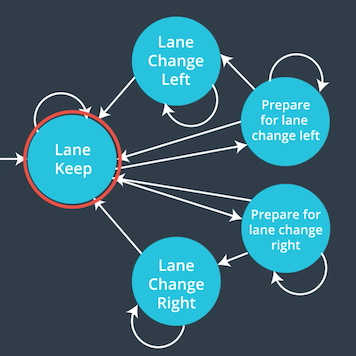

# Path Planning Project

## File structure
The file structure of my implementation is like below.
```
src
├── Eigen-3.3
├── cost.cpp: C++ source file for cost function
├── cost.h: C++ header file for cost function
├── json.hpp
├── main.cpp
├── spline.h: spline library
├── vehicle.cpp: C++ source file for Vehicle class
└── vehicle.h: C++ source file for Vehicle class
```

## Behavior planning
I implemented a behavior planning using finite state machine.
The behavior planner is used for generating the path and speed for the car to follow.
The planner decides if the car will be in the current lane or change lane to right or left.
As well as it generate next positions which the car will drive in the future.
Finally, the path is generated with the `spline` library.

### Finite State Machine
I make use of a finite state machine (FMS) with 5 states in order to decide next actions
The 5 states consists of lane keep, lane change left, lane change right, prepare for lane change left and prepare for lane change right.
The FMS decides a next state choosing the minimum cost function.



As you see above, the FMS stats with the lane keep state.
Based on the context of both of the car, road and other car, the FSM decide to stay at the same as lane keep state, to change to prepare for lane change left or right or to change to lane change left of right.
All possible states at each state are evaluated with the cost function, and then the state with the minimum cost is  selected as the next state.

At the lane keep state, the FSM can stay at the same state or move to the lane change left or right states (PLCL or PLCR) based on  a cost fuction.
However, when the car is on either of the lateral lanes (lane 0 or 2), it selects only the possible lane.
Plus, the car will stay in the same lane if there is no other vehicle that prevents it from reaching the maximum reference speed limit of the road.

Then if the PLCL/PLCR are selected, the car prepares to change lane to left or right.
The preparation checks if the car speed and the buffer space are safe to change lance.
The car may stay in PLCL/PLCR state until the buffer is safe enough to change lane or even decide to return to state KL (same lane) if the cost to change the lane is no longer relevant to left or right.

The FSM will transition to LCL/LCR states, when there is enough buffer space to change lane.
The FSM returns to state KL as soon the lane change is over (car is between the lane lines).

#### Cost Function
The cost function is used for choosing a next state in the FSM.
It evaluates different metrics trying to identify the next optimal state.
Below, the metrics and how they are evaluated  are presented in detail:

##### Target speed of a car in front
The target car speed cost evaluates the gap between the ego car speed and the vehicle speed in front (possible collision).
If all lanes are blocked (possible collision), this function helps the car to choose a lane which the speed of the vehicle in question matches closer to the ego car.

```cpp
double CostFunction::reference_velocity_cost() {
  /**
   * get the gap between the reference velocity and actual speed
   */
  double cost =0;
  if (!vehicle->collider.collision) {
    return 0;
  }
  double diff = (vehicle->collider.target_speed - vehicle->speed)/vehicle->collider.target_speed;
  cost = pow(diff, 2) * EFFICIENCY;
  return cost;
}
```

##### Sufficient speed to change lane
In just case, the velocity of ego car should be relatively higher when it changes lane to be safe.
If a end lane is different from a start lane in a trajectory and the speed is less than 20 here, the function penalizes the transition in the FSM.
Here, the coefficient is defined as `SUFFICIANT_SPEED`.
```cpp
double CostFunction::sufficiant_speed_cost() {
  /**
   * Check if the speed is enough to change lanes.
   */
  int start_lane = vehicle->trajectory.lane_start;
  int end_lane = vehicle->trajectory.lane_end;
  if (start_lane != end_lane && vehicle->speed < 20) {
    return SUFFICIANT_SPEED; // return the coefficient
  }
  return 0;
}
```

##### Change Lane
The function to get a cost if the ego car tries to change lane.
Here, the coefficient is defined as `COMFORT`.
```cpp
double CostFunction::change_lane_cost(){
  //Compute cost to change lane, penalizes lane Away fron the leftiest lane (fastest).
  int end_lane = vehicle->trajectory.lane_end;
  int start_lane = vehicle->trajectory.lane_start;
  double cost = 0;
  if (start_lane != end_lane) {
    cost = COMFORT; // return the coefficient
  }
  return cost;
}
```

##### Buffer
The buffer cost function computes how long it has to the vehicle in front.
It is computed by dividing the distance from the vehicle in front by the current speed of the ego car.
Note that the cost is smaller if the vehicle in question is behind.
It helps the ego car to choose a lane with no traffic in the front.
```cpp
double CostFunction::buffer_cost(){
  double cost = 0;
  // There is enough buffer in front of the car.
  if(vehicle->collider.closest_approach == 10000){
    return 0;
  }

  // check buffer in front.
  double time_steps = abs(vehicle->collider.closest_approach) / (abs(vehicle->speed) * MPH_TO_MS);
  if (time_steps > DESIRED_BUFFER) {
    return 0;
  }

  // check buffer behind.
  double multiplier = 1.0 - pow((time_steps / DESIRED_BUFFER), 2);
  cost = multiplier * DANGER; // multiply the coefficient
  if (vehicle->collider.closest_approach < 0) {
    // car in the back
    cost /= 10;
  }
  return cost;
}
```

##### Inefficiency:
This function evaluates the vehicle speed defined in this state in relation to the maximum speed allowed.
States with speeds closer to the maximum speed are more efficient (lower cost), in contrast, states with lower speeds are less efficient (higher cost).

```cpp
double CostFunction::inefficiency_cost(){
  //Always, the best efficiency is when the speed is closest to the limit
  double cost = 0;
  double diff = (49.5 - vehicle->reference.target_v)/49.5;
  cost = pow(diff,2) * EFFICIENCY; // multiply the coefficient
  return cost;
}
```

##### Collision:
The collision cost is the most important function.
It strongly penalizes the states which the risk of collision is more imminent.
However, in order to force the car to escape from heavy traffic, the collision cost is smaller whenever is safe to change lane.
We found out that it helps the car to find a more appropriate situation, instead of just following the car ahead until it opens a passageway.
```cpp
double CostFunction::collision_cost(){
  double cost = 0;
  if(vehicle->collider.collision){
    double distance =  vehicle->collider.distance;
    //distance divided by the relative speed
    double time_to_collide = abs(vehicle->collider.distance) / (abs(vehicle->speed) * MPH_TO_MS);
    cost = exp(-pow(time_to_collide,2)) * COLLISION; // multiply the coefficient.
    //changing lane
    if (vehicle->trajectory.lane_end != vehicle->trajectory.lane_start) {
      if(time_to_collide > DESIRED_BUFFER){
        //safe to change lane
        cost /= 10;
      }
    }
  }
  return cost;
}
```

### Path Generation and Speed control
The FSM defines the lane and the speed to be followed for every state, from a high-level point of view,
For example, if the car is changing lane, the FSM will return a different one from the current lane.
The same is for speed, the FSM will return for every state the target speed the ego car should follow.

```cpp
// compute next state
vehicle.update_data(car_x, car_y, car_s, car_d, car_yaw, car_speed, lane, ref_vel, prev_size*.02);
vehicle.choose_next_state(sensor_fusion);

// update lane and reference velocity to generate path
lane = vehicle.reference.lane;
ref_vel = vehicle.reference.ref_v;
```

After the FSM returns the lane and speed to follow, the controller generates up to 50 map coordinates back to the simulator.
These points define the path to be followed by the car.

#### Acceleration and Jerk control
The requirements of this project state that the acceleration and jerk should not exceed 10 m/s^2 and 50m/s^3, respectively.
The car acceleration is increased or decreased by steps of 0.224 m/s^2 to meet this requirement,
The limit 0.224 is computed as follows: max acceleration of 10 m/s^2, with delta time of 0.02 seconds in miles per hour: `2.24 / 10`

```cpp
// modify reference velocity
if (!collider.collision && ref_speed < reference.target_v && ref_speed < 49.5) {
  reference.ref_v += 0.224;
} else if (ref_speed > reference.target_v && ref_speed > 0) {
  reference.ref_v -= 0.224;
}
```

#### Spline for path generation
Spline is a piecewise "polynomial" parametric curve.
They are popular for their simplicity of use and accuracy.
Our path planner uses the Spline mathematical function for curve fitting the generated map coordinates.
The spline helps to define a smooth path for the car (see file 'main.cpp' lines 260-372). .

The path generation is an elaborate set of tasks. First, our planner has to generate equally spaced map coordinates. We use the helper function "getXY" to generate points from Freenet to Cartesian coordinates.

```cpp
// get next way points in x-y coordinate from Fenet coordinate
vector<double> next_wp0 = getXY(car_s + 30, (2+4*lane), map_waypoints_s, map_waypoints_x, map_waypoints_y);
vector<double> next_wp1 = getXY(car_s + 60, (2+4*lane), map_waypoints_s, map_waypoints_x, map_waypoints_y);
vector<double> next_wp2 = getXY(car_s + 90, (2+4*lane), map_waypoints_s, map_waypoints_x, map_waypoints_y);

ptsx.push_back(next_wp0[0]);
ptsx.push_back(next_wp1[0]);
ptsx.push_back(next_wp2[0]);

ptsy.push_back(next_wp0[1]);
ptsy.push_back(next_wp1[1]);
ptsy.push_back(next_wp2[1]);

for(int i=0; i<ptsx.size(); i++){
  // shift car reference angle to 0 degrees
  double shift_x = ptsx[i] - ref_x;
  double shift_y = ptsy[i] - ref_y;

  ptsx[i] = (shift_x *cos(0-ref_yaw) - shift_y*sin(0-ref_yaw));
  ptsy[i] = (shift_x *sin(0-ref_yaw) + shift_y*cos(0-ref_yaw));
}

// spline
tk::spline s;
s.set_points(ptsx, ptsy);
```

After, with the spline function already done, we have to recompute the map points back from the curve. This task is accomplished by breaking up the spline into equidistant points that respect the desired speed.

Considering the time interval of 20 ms, the travel distance of 30 meters on x-axis with the speed "ref_speed", we have:

```cpp
double target_x = 30.0;
double target_y = s(target_x);
double target_dist = sqrt((target_x) * (target_x) + (target_y)*(target_y));
```

Finally, the final part is to compute the coordinates from spline and shift its orientation back.

```cpp
double x_add_on = 0;
for(int i = 0; i < 50-previous_path_x.size(); i++){
  double N = (target_dist/(0.02*ref_vel/2.24));
  double x_point = x_add_on + (target_x)/N;
  double y_point = s(x_point);

  x_add_on = x_point;

  double x_ref = x_point;
  double y_ref = y_point;

  x_point = (x_ref * cos(ref_yaw)-y_ref*sin(ref_yaw));
  y_point = (x_ref * sin(ref_yaw)+y_ref*cos(ref_yaw));
  x_point += ref_x;
  y_point += ref_y;

  next_x_vals.push_back(x_point);
  next_y_vals.push_back(y_point);
}
```
